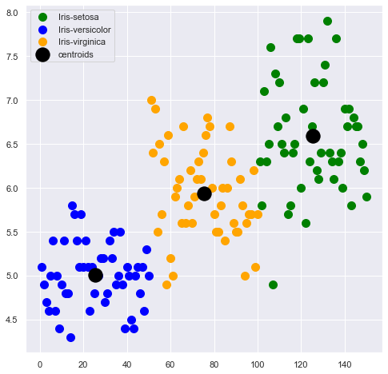

## Task 02
### Problem Statement:
- From the given ‘Iris’ dataset, predict the optimum number of clusters and
represent it visually.
### Dataset:
- Link of dataset : [Iris](dataset/Iris.csv)

## Outcome of the model:
