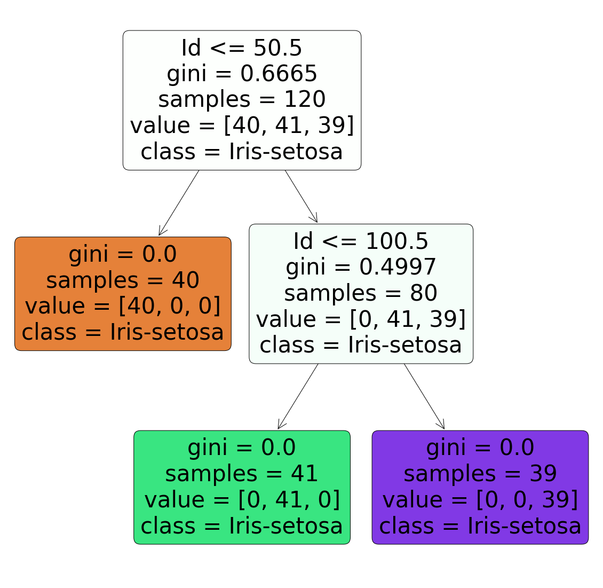

## Task 03
## Task Description:
- The purpose is if we feed any new data to this classifier, it would be able to
predict the right class accordingly.
### Dataset:
- Link of dataset : [Iris](dataset/iris.csv)

### Problem Statement:
- For the given ‘Iris’ dataset, create the Decision Tree classifier and visualize it
graphically.
## Outcome:

## Outcome of the model:
